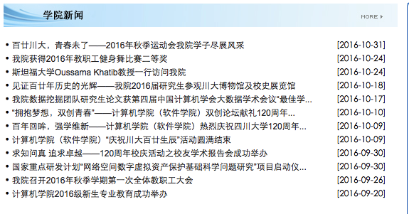

# 新闻网站调查指南

目前只需要给出索引链接的模式, 以计算机学院为例:

先访问网址:
http://cs.scu.edu.cn/

例如要选择学院通知板块, 点击右边的more:

访问的网址为 http://cs.scu.edu.cn/cs/xytz/H9502index_1.htm

给出 http://cs.scu.edu.cn/cs/xytz/H9502index_<index>.htm 即可
