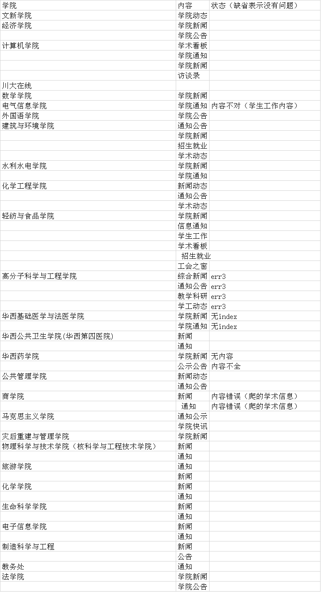

# 第四周开发报告
## 小组工作内容
我们小组在该课程设计内容部分所做的工作是实现一个用于收集各个学院新闻和通知信息的爬虫系统，并将之应用到我们的软件之中。

## 相关工作进程
我们小组使用了Scala在组长的云服务器上生成了一个爬虫程序来作为主要的工作程序
当前，我们小组将各个学院的新闻和通知页面建立了一个URL表，将这些URL通过云端的程序自动地去抓取。一部分学院的页面爬取出现了一些问题。以下就是学院信息的汇总

## 评价和结论
显然我们的工作还有一些应该改进的地方，不过已经基本完成所需内容的爬取
